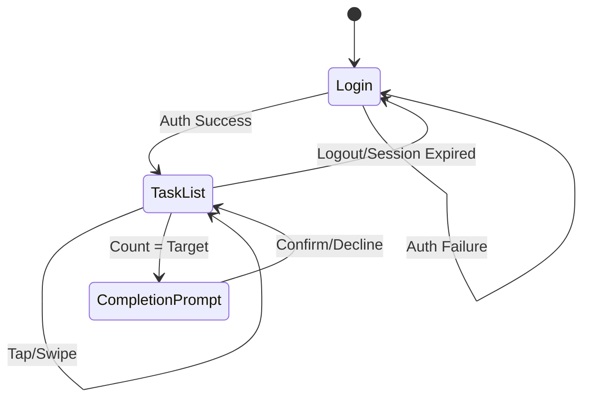

# Design Document

## Overview

The Factory Task Tracker is a single-page web application (SPA) built as a headless client connecting to the G4U API. The app provides factory workers with a simple, touch-friendly interface to track repetitive task executions. Built with vanilla HTML/CSS/JavaScript using Tailwind CSS for styling, matching the provided dark-themed factory management design.

### Key Design Decisions

- **Vanilla JS + Tailwind**: No framework overhead, fast loading, easy deployment
- **Single HTML file approach**: Simple deployment, all logic in one place
- **Touch-first interactions**: Optimized for mobile/tablet use on factory floor
- **Optimistic UI updates**: Immediate feedback with background API sync

## Architecture

```mermaid
flowchart TB
    subgraph Client["Browser (SPA)"]
        UI[UI Layer]
        State[State Manager]
        API[API Client]
    end
    
    subgraph External["G4U API"]
        Auth[/auth/login]
        Tasks[/tasks]
    end
    
    UI --> State
    State --> API
    API --> Auth
    API --> Tasks
```

### Application Flow



## Components and Interfaces

### 1. API Client Module

Handles all communication with the G4U API.

```typescript
interface ApiClient {
  login(credentials: LoginCredentials): Promise<AuthResponse>;
  getTasks(): Promise<Task[]>;
  updateTaskExecution(taskId: string, executionCount: number): Promise<Task>;
  markTaskComplete(taskId: string): Promise<Task>;
}

interface LoginCredentials {
  email: string;
  password: string;
}

interface AuthResponse {
  token: string;
  user: {
    id: string;
    name: string;
  };
}
```

### 2. State Manager

Manages application state and coordinates UI updates.

```typescript
interface AppState {
  isAuthenticated: boolean;
  user: User | null;
  tasks: Task[];
  isLoading: boolean;
  error: string | null;
}

interface StateManager {
  getState(): AppState;
  setState(partial: Partial<AppState>): void;
  subscribe(listener: (state: AppState) => void): () => void;
}
```

### 3. UI Components

#### Login Screen
- Email/Employee ID input field
- Password input field with visibility toggle
- Login button with loading state
- Error message display

#### Task List Screen
- Header with title and refresh button
- Active tasks section (task cards)
- Completed section header
- Completed tasks section (grayed out cards)

#### Task Card
- Task name display
- Progress indicator (X / Y format)
- Progress bar
- Touch/click handler for increment
- Swipe handler for decrement

#### Completion Modal
- "Task completed?" prompt
- Yes/No buttons
- Backdrop overlay

## Data Models

### Task

```typescript
interface Task {
  id: string;
  name: string;
  targetCount: number;      // How many times task must be done
  executionCount: number;   // How many times task has been done
  isCompleted: boolean;     // Whether user confirmed completion
  createdAt: string;
  updatedAt: string;
}
```

### User

```typescript
interface User {
  id: string;
  name: string;
  email: string;
}
```

### API Response Types

```typescript
interface ApiError {
  message: string;
  code: string;
}

interface TaskListResponse {
  tasks: Task[];
  total: number;
}
```


## Correctness Properties

*A property is a characteristic or behavior that should hold true across all valid executions of a system-essentially, a formal statement about what the system should do. Properties serve as the bridge between human-readable specifications and machine-verifiable correctness guarantees.*

### Property 1: Valid credentials authenticate successfully
*For any* valid email/password combination, calling the login function SHALL return an authenticated state with a valid token and user object.
**Validates: Requirements 1.1**

### Property 2: Invalid credentials produce error state
*For any* invalid credential combination, calling the login function SHALL return an error state and the authenticated flag SHALL remain false.
**Validates: Requirements 1.2**

### Property 3: Empty credentials are rejected before API call
*For any* credentials where email or password is empty or whitespace-only, the validation function SHALL return false and no API call SHALL be made.
**Validates: Requirements 1.3**

### Property 4: Task card rendering contains required information
*For any* task object, the rendered card output SHALL contain the task name and display the execution count and target count in "X / Y" format, and the progress bar width SHALL equal (executionCount / targetCount) * 100 percent.
**Validates: Requirements 2.2, 2.3**

### Property 5: Tasks are sorted with active before completed
*For any* list of tasks, after sorting, all tasks where isCompleted=false SHALL appear before all tasks where isCompleted=true.
**Validates: Requirements 2.4**

### Property 6: Increment increases execution count by exactly one
*For any* active task (isCompleted=false), calling the increment function SHALL increase executionCount by exactly 1, and the new count SHALL not exceed targetCount.
**Validates: Requirements 3.1**

### Property 7: Decrement decreases execution count with floor at zero
*For any* task, calling the decrement function SHALL decrease executionCount by 1 if executionCount > 0, otherwise executionCount SHALL remain 0.
**Validates: Requirements 3.2**

### Property 8: Completion prompt triggers at target count
*For any* task where executionCount equals targetCount after an increment operation, the system SHALL trigger a completion prompt.
**Validates: Requirements 4.1**

### Property 9: Confirming completion marks task complete and reorders
*For any* task at target count, confirming completion SHALL set isCompleted=true and the task SHALL appear in the completed section after re-sorting.
**Validates: Requirements 4.2**

### Property 10: Declining completion keeps task active
*For any* task at target count, declining completion SHALL keep isCompleted=false and the task SHALL remain in the active section.
**Validates: Requirements 4.3**

### Property 11: API errors set error state
*For any* API request that fails, the state manager SHALL set error to a non-null message and isLoading to false.
**Validates: Requirements 5.1**

### Property 12: Logout resets to unauthenticated state
*For any* logout action or expired session, the state SHALL reset isAuthenticated to false and user to null.
**Validates: Requirements 5.3**

## Error Handling

### API Errors
- Network failures: Display "Connection error. Please check your network and try again."
- 401 Unauthorized: Clear session and redirect to login
- 400 Bad Request: Display specific validation error from API response
- 500 Server Error: Display "Server error. Please try again later."

### Input Validation Errors
- Empty email: "Email or Employee ID is required"
- Empty password: "Password is required"
- Invalid format: "Please enter a valid email or Employee ID"

### State Recovery
- On API failure during task update: Revert optimistic update and show error toast
- On session expiry: Preserve current view state, redirect to login, restore after re-auth

## Testing Strategy

### Testing Framework
- **Unit Tests**: Vitest for fast, modern JavaScript testing
- **Property-Based Tests**: fast-check library for property-based testing in JavaScript
- **Configuration**: Each property test runs minimum 100 iterations

### Unit Tests
Unit tests cover specific examples and edge cases:

1. **API Client Tests**
   - Login with mock valid credentials returns token
   - Login with mock invalid credentials returns error
   - Task fetch returns parsed task array
   - Task update sends correct payload

2. **State Manager Tests**
   - Initial state is unauthenticated
   - setState merges partial state correctly
   - Subscribers are notified on state change

3. **UI Logic Tests**
   - Progress percentage calculation for edge cases (0/5, 5/5, 3/10)
   - Task sorting with mixed completed/active tasks
   - Validation rejects empty strings and whitespace

### Property-Based Tests
Property tests verify universal properties across all inputs:

1. **Credential Validation Property** (Property 3)
   - Generate random whitespace strings, verify all rejected

2. **Task Rendering Property** (Property 4)
   - Generate random tasks, verify output contains name and "X / Y" format

3. **Task Sorting Property** (Property 5)
   - Generate random task lists, verify active tasks precede completed

4. **Increment Property** (Property 6)
   - Generate random active tasks, verify increment adds exactly 1

5. **Decrement Property** (Property 7)
   - Generate random tasks, verify decrement floors at 0

6. **Completion Trigger Property** (Property 8)
   - Generate tasks near completion, verify prompt triggers at exact match

7. **Completion Confirmation Property** (Property 9)
   - Generate completed tasks, verify confirmation sets isCompleted=true

8. **Decline Completion Property** (Property 10)
   - Generate tasks at target, verify decline keeps isCompleted=false

### Test File Structure
```
/tests
  /unit
    api-client.test.js
    state-manager.test.js
    ui-logic.test.js
  /property
    validation.property.test.js
    task-operations.property.test.js
    task-sorting.property.test.js
```

### Test Annotations
Each property-based test MUST include a comment in this format:
```javascript
// **Feature: factory-task-tracker, Property 6: Increment increases execution count by exactly one**
```
