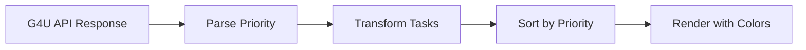

# Design Document

## Overview

This enhancement adds priority-based sorting and visual indicators to the Factory Task Tracker. Priority is extracted from the `comments` array in API responses (format: `PRIORITY:X` where X is 1-10), with 1 being highest priority and 10 being lowest. Tasks are sorted by priority within the active section, and colored left borders provide visual urgency cues.

### Key Design Decisions

- **Priority in comments**: Leverages existing API structure without backend changes
- **Color gradient**: Red (urgent) → Yellow (medium) → Blue (low) follows common UX patterns
- **Left border indicator**: Non-intrusive visual cue that doesn't affect card layout
- **Default to lowest**: Tasks without priority don't block urgent work

## Architecture

The priority feature integrates into the existing task processing pipeline:



## Components and Interfaces

### 1. Priority Parser Function

Extracts priority from the comments array of an action.

```javascript
/**
 * Extract priority from comments array
 * @param {string[]} comments - Array of comment strings
 * @returns {number} Priority value (1-10, default 10)
 */
function extractPriority(comments) {
  // Returns 1-10, defaults to 10 if not found
}
```

### 2. Priority Color Mapper

Maps priority value to border color class.

```javascript
/**
 * Get border color class for priority
 * @param {number} priority - Priority value (1-10)
 * @returns {string} Tailwind border color class
 */
function getPriorityBorderColor(priority) {
  // 1-3: red, 4-7: yellow/orange, 8-10: blue
}
```

### 3. Enhanced Sort Function

Updates existing `sortTasks` to sort by priority within active tasks.

```javascript
/**
 * Sort tasks: active by priority (asc), then completed
 * @param {Task[]} tasks - Array of tasks with priority
 * @returns {Task[]} Sorted tasks
 */
function sortTasks(tasks) {
  // Stable sort: active tasks by priority, completed at end
}
```

### 4. Enhanced Task Card Renderer

Updates `renderTaskCard` to include priority border styling.

```javascript
/**
 * Render task card with priority border
 * @param {Task} task - Task with priority
 * @param {boolean} isCompleted - Completion status
 * @returns {string} HTML string with priority border
 */
function renderTaskCard(task, isCompleted) {
  // Adds left border with priority color
}
```

## Data Models

### Enhanced Task Object

```typescript
interface Task {
  id: string;
  name: string;
  targetCount: number;
  executionCount: number;
  isCompleted: boolean;
  priority: number;        // NEW: 1-10, extracted from comments
  teamName?: string;
  tasks: Action[];         // Raw actions from API
  hasConflict?: boolean;
}

interface Action {
  id: string;
  status: 'PENDING' | 'DONE';
  comments: string[];      // Contains "PRIORITY:X"
  // ... other fields
}
```

### Priority Color Mapping

| Priority Range | Color | Tailwind Class |
|---------------|-------|----------------|
| 1-3 (High) | Red | `border-l-red-500` |
| 4-7 (Medium) | Yellow/Orange | `border-l-yellow-500` |
| 8-10 (Low) | Blue | `border-l-blue-500` |

## Correctness Properties

*A property is a characteristic or behavior that should hold true across all valid executions of a system-essentially, a formal statement about what the system should do. Properties serve as the bridge between human-readable specifications and machine-verifiable correctness guarantees.*

### Property 1: Priority sorting order
*For any* list of active tasks with priorities, after sorting, each task's priority SHALL be less than or equal to the next task's priority (ascending order).
**Validates: Requirements 1.1**

### Property 2: Stable sort for equal priorities
*For any* list of tasks where multiple tasks have the same priority, after sorting, those tasks SHALL maintain their original relative order.
**Validates: Requirements 1.3**

### Property 3: Completed tasks remain separate
*For any* list of tasks containing both active and completed tasks, after sorting, all active tasks SHALL appear before all completed tasks regardless of priority values.
**Validates: Requirements 1.4**

### Property 4: Priority-to-color mapping
*For any* priority value from 1-10, the color mapping function SHALL return red for 1-3, yellow/orange for 4-7, and blue for 8-10. For tasks with no priority (default 10), the function SHALL return blue.
**Validates: Requirements 2.1, 2.2, 2.3, 2.4, 2.5**

### Property 5: Priority parsing from comments
*For any* comments array containing one or more "PRIORITY:X" patterns, the parser SHALL extract the numeric value from the first occurrence.
**Validates: Requirements 3.1, 3.4**

### Property 6: Priority clamping
*For any* extracted priority value outside the 1-10 range, the parser SHALL clamp it to the valid range (values < 1 become 1, values > 10 become 10).
**Validates: Requirements 3.2**

### Property 7: Default priority for missing comments
*For any* task with empty, null, undefined, or comments array without a PRIORITY pattern, the parser SHALL return priority 10.
**Validates: Requirements 1.2, 3.3**

## Error Handling

### Invalid Priority Values
- Non-numeric values after "PRIORITY:": Default to 10
- Negative numbers: Clamp to 1
- Numbers > 10: Clamp to 10
- Decimal numbers: Round to nearest integer

### Missing Data
- No comments array: Default priority 10
- Empty comments array: Default priority 10
- Malformed PRIORITY pattern: Skip and check next comment

## Testing Strategy

### Testing Framework
- **Unit Tests**: Vitest for JavaScript testing
- **Property-Based Tests**: fast-check library
- **Configuration**: Each property test runs minimum 100 iterations

### Unit Tests
1. **Priority Parser Tests**
   - Parse "PRIORITY:1" returns 1
   - Parse "PRIORITY:10" returns 10
   - Parse empty array returns 10
   - Parse array without PRIORITY returns 10
   - Parse "PRIORITY:0" returns 1 (clamped)
   - Parse "PRIORITY:15" returns 10 (clamped)

2. **Color Mapper Tests**
   - Priority 1 returns red class
   - Priority 5 returns yellow class
   - Priority 10 returns blue class

3. **Sort Tests**
   - Tasks sorted by priority ascending
   - Completed tasks remain at end
   - Equal priorities maintain order

### Property-Based Tests
Each property from the Correctness Properties section will have a corresponding property-based test:

1. **Property 1**: Generate random task lists, verify ascending priority order
2. **Property 2**: Generate tasks with duplicate priorities, verify stable sort
3. **Property 3**: Generate mixed active/completed lists, verify separation
4. **Property 4**: Generate all priority values 1-10, verify correct color mapping
5. **Property 5**: Generate comments with PRIORITY patterns, verify first extraction
6. **Property 6**: Generate out-of-range priorities, verify clamping
7. **Property 7**: Generate empty/missing comments, verify default 10

### Test Annotations
Each property-based test MUST include:
```javascript
// **Feature: task-priority-sorting, Property N: [property description]**
```
